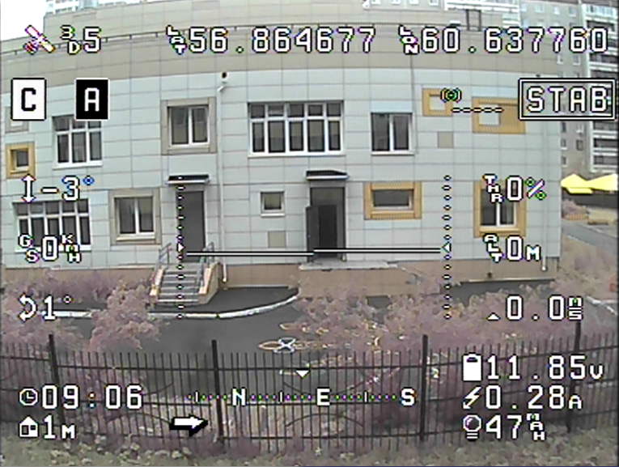

MultiOSD
========

Yet another MinimOSD firmware with configurable screens.

**Warning: this software is on early alpha stage!**

Capabilities:

   * switching between screens
   * configuration console
   * no image snow
   * ADC RSSI and battery stats - useful with simple FC, such as CC3D

Supported flight controllers and software
----------------------------

* CC, CC3D/CC3D Atom (tested), Revoluition (tested).
  
  Supported FC firmware:
  
  * OpenPilot 15.02.02 (latest CC/CC3D release)
  * OpenPilot 15.05.02 (latest Revolution release)
  * LibrePilot 15.09 (https://github.com/librepilot/LibrePilot)
  
* Many of MAVLink boards:
  
   * APM 2.x (tested)
   * Pixhawk PX4
   * Paparazzi
   * Generic MAVLink boards

**Testers are needed!**

Already available indicators
----------------------------

- Altitude
- Climb rate
- Flight mode
- Armed indicator
- Connected indicator
- Flight time (time since FC boot actually)
- Roll angle
- Pitch angle
- GPS state
- GPS Latitude
- GPS Longitude
- Artifical horizon
- Throttle
- Ground speed
- Battery voltage
- Battery current
- Battery consumed
- RSSI flag
- Distance to home
- Direction to home
- Callsign
- Temperature
- RSSI level
- Compass

More to come.

Known bugs and problems
-----------------------

- No configuration software (https://github.com/UncleRus/MultiConf)
  currently in development
- No documentation!
- Home direction bug
- CC3D Revolution home distance/direction bug

