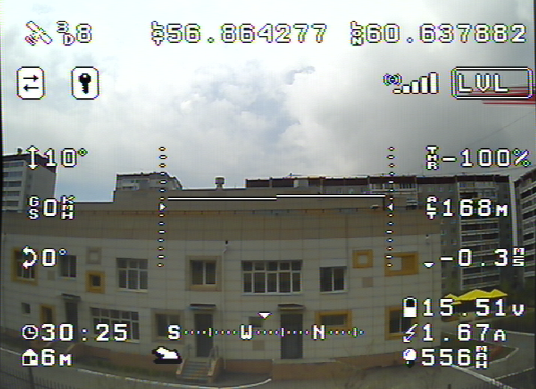

# MultiOSD

Yet another MinimOSD firmware with configurable screens layout.

* up to 8 screens with up to 24 indicators each
* configuration console
* no image snow
* ADC RSSI and battery stats

## Supported flight controllers and software

### UAVTalk module

* All OpenPilot family flight controllers (CopterControl, CC3D/CC3D Atom,
  Revoluition, Revoluition Nano):
  * OpenPilot 15.02.02 (latest CC/CC3D release)
  * OpenPilot 15.05.02 (latest Revolution release)
  * LibrePilot 15.09 (http://librepilot.org)
  * LibrePilot Next release
* All TauLabs 20151123 (http://taulabs.org) boards
* All dRonin dRonin 2016-04-09.2 (http://dronin.org) boards

### MAVLink module  

* APM 2.xx (ArduCopter, ArduPilot)
* Pixhawk PX4 (ArduCopter, ArduPilot)
* Paparazzi
* Generic MAVLink boards

### UBX module

* u-blox GPS modules - *experimental*

**Any help would be appreciated**

## Available indicators

* Altitude
* Climb rate
* Flight mode
* Armed indicator
* Connected indicator
* Flight time (FC uptime actually)
* Roll angle
* Pitch angle
* GPS state
* GPS Latitude
* GPS Longitude
* Artifical horizon
* Throttle
* Groundspeed
* Flight battery voltage
* Flight battery current
* Flight battery consumed
* Secondary battery voltage
* RSSI flag
* Distance to home
* Direction to home
* Callsign
* Temperature
* RSSI level
* Compass
* Airspeed

More to come.

## Build and install

[MultiOSD Building](doc/build.md)

## Configure

You can use [the serial console](doc/configure.md)
to change [options](doc/settings.md) and screens layout.

## Todo

* UBX autoconfig
* MultiWii Serial Protocol
* Configuration GUI

