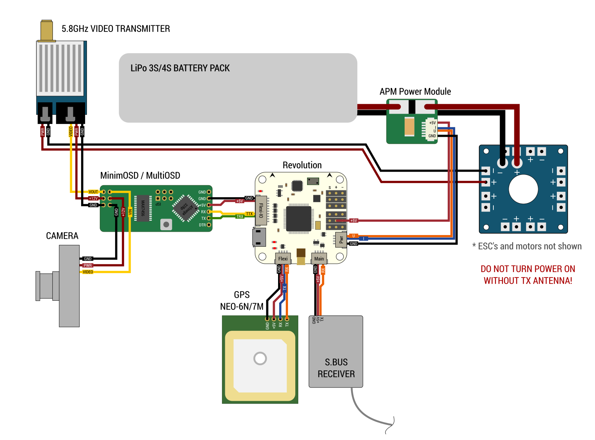

# MultiOSD setup examples

## CC3D / LibrePilot

## Revolution / LibrePilot

### Connection diagram

### Revolution setup

### MultiOSD setup

        $ cd /path/to/MultiOSD
        $ python tools/flasher.py -p /dev/ttyUSBn -b 57600 build/MultiOSD_uavtalk.hex
        $ python tools/font_uploader.py -p /dev/ttyUSBn res/font.mcm
        $ python tools/console.py -p /dev/ttyUSBn
        
Reset settings to default:

        osd# reset

Set UAVTalk version to LibrePilot 15.09:

        osd# opt s utrel 2

Set UAVTalk bitrate to 57600:

        osd# opt s utbr 3

Use FC home position:

        osd# opt s utihc 0

Three screens will be available:        

        osd# opt s screens 3

Set screen switching mode toggle:

        osd# opt s swm 1

Set Auxillary 2 (channel 7) as screens switch:

        osd# opt s swch 7

Set callsign:

        osd# opt s callisgn TEST!

Press Ctrl+D to exit.
        

## CC3D / Cleanflight

## CC3D / dRonin

## APM / Arducopter

## U-blox NEO-6M
