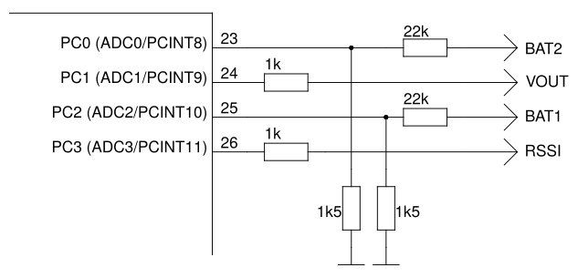
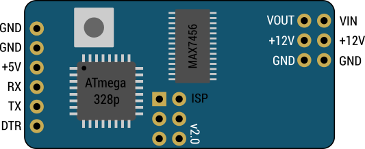

*****************
MultiOSD hardware
*****************

Original MinimOSD / clone
=========================

Description
-----------

No additional ADC pins.

Pinout
------

.. image:: img/hw_minimosd_orig.png
   :alt: Original MinimOSD
   

Examples
--------

KV Team OSD big
===============

Description
-----------

Similar to original MinimOSD but has additional ADC inputs. Two of them (BAT1
and BAT2) are connected through voltage dividers with ratio 15.67.

Pinout
------

.. image:: img/hw_kvteam_big.png
   :alt: KV Team big OSD
   

   
Examples
--------

MAVLink-OSD v1.0
================

Description
-----------

Same schematic as original MinimOSD but PCB layout is differnt.

Pinout
------

.. image:: img/hw_mavlinkosd_v1.png
   :alt: MAVLink-OSD v1.0

Examples
--------

MAVLink-OSD v2.0
================

Description
-----------

Additional ADC inputs on PCB bottom. Two of them (2 and 4) are connected
through voltage dividers with ratio 15.67.
Seems like schematic the same as KV Team OSD but additional pins numbering
is different.

Pinout
------

.. image:: img/hw_mavlinkosd_v2_bottom.png
   :alt: MAVLink-OSD v2.0 bottom

.. image:: img/hw_mavlink_osd_v2_schem.png
   :alt: MAVLink-OSD v2.0 additional pins

Examples
--------

